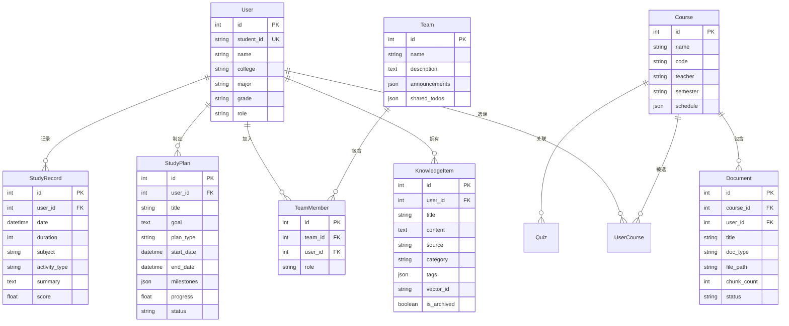

## 1. 架构设计

```mermaid
graph TB
    subgraph "前端层"
        "React 18 + TypeScript"
        "TailwindCSS"
        "Zustand 状态管理"
        "React Router"
    end
    subgraph "后端层"
        "FastAPI (Python)"
        "RAG引擎"
        "CAS认证服务"
        "学习分析服务"
    end
    subgraph "数据层"
        "MySQL (用户/课程/计划)"
        "DashVector (向量检索)"
    end
    subgraph "外部服务"
        "阿里云DashScope (通义千问)"
        "阿里云文本嵌入"
        "合工大CAS认证"
    end
    "React 18 + TypeScript" --> "FastAPI (Python)"
    "FastAPI (Python)" --> "MySQL (用户/课程/计划)"
    "FastAPI (Python)" --> "DashVector (向量检索)"
    "RAG引擎" --> "阿里云DashScope (通义千问)"
    "RAG引擎" --> "阿里云文本嵌入"
    "RAG引擎" --> "DashVector (向量检索)"
    "CAS认证服务" --> "合工大CAS认证"
```

## 2. 技术说明
- **前端**：React@18 + TypeScript + TailwindCSS@3 + Vite
- **初始化工具**：vite-init (react-ts 模板)
- **状态管理**：Zustand
- **图标库**：lucide-react
- **后端**：FastAPI (Python，已独立部署在 backend/ 目录)
- **数据库**：MySQL (结构化数据) + DashVector (向量数据)
- **AI服务**：阿里云 DashScope (通义千问 + 文本嵌入)

## 3. 路由定义
| 路由 | 用途 |
|------|------|
| /login | CAS登录页 |
| /dashboard | 智能仪表盘 |
| /courses | 课程列表 |
| /courses/:id | 课程详情(问答+测验) |
| /papers | 论文精读 |
| /knowledge | 个人知识库 |
| /study | 学习规划 |
| /study/plan/:id | 计划详情 |
| /teams | 团队协作 |
| /schedule | 课表视图 |

## 4. API定义

### 4.1 认证相关
```typescript
// GET /api/auth/cas/login → { login_url: string }
// GET /api/auth/cas/callback?ticket=xxx → { user_id, student_id, name, college, major }
// GET /api/auth/schedule/:user_id → { schedule: ScheduleItem[], semester: string }
// GET /api/auth/profile/:user_id → UserProfile
```

### 4.2 课程相关
```typescript
// GET /api/course/list?user_id=x → { courses: Course[] }
// POST /api/course/add → { message, course_id }
// POST /api/course/upload → { message, document_id, status, chunk_count }
// POST /api/course/ask → { answer, sources, question }
// POST /api/course/quiz/generate → { quiz: QuizQuestion[], document_title }
```

### 4.3 知识库相关
```typescript
// POST /api/knowledge/add → { message, id }
// GET /api/knowledge/search?query=x&user_id=x → { results, query }
// POST /api/knowledge/ask → { answer, sources, question }
// GET /api/knowledge/categories?user_id=x → { categories: string[] }
// GET /api/knowledge/items?user_id=x → { items, page, page_size }
// PUT /api/knowledge/:id/archive → { message }
```

### 4.4 论文相关
```typescript
// POST /api/paper/analyze → { analysis: PaperAnalysis }
// POST /api/paper/summarize → { summary: string }
// POST /api/paper/qa → { answer: string }
// POST /api/paper/suggest-related → { related_topics, search_keywords, suggested_directions }
```

### 4.5 学习规划相关
```typescript
// POST /api/study/plan/create → { plan_id, ai_plan, message }
// GET /api/study/plan/list?user_id=x → { plans: StudyPlan[] }
// POST /api/study/record → { message, record_id }
// GET /api/study/stats?user_id=x&days=x → { stats, efficiency_score }
// GET /api/study/daily-report?user_id=x → { report, date }
```

### 4.6 团队协作相关
```typescript
// POST /api/team/create → { message, team_id }
// POST /api/team/join → { message }
// GET /api/team/list?user_id=x → { teams: Team[] }
// POST /api/team/announcement → { message }
// POST /api/team/todo → { message }
// PUT /api/team/todo/:team_id/:todo_index → { message }
```

### 4.7 仪表盘相关
```typescript
// GET /api/dashboard/overview?user_id=x → DashboardOverview
// GET /api/dashboard/recent-activities?user_id=x → { activities: Activity[] }
```

### 4.8 核心类型定义
```typescript
interface ScheduleItem {
  course_name: string;
  course_code: string;
  teacher: string;
  location: string;
  day_of_week: number;
  start_section: number;
  end_section: number;
  weeks: string;
  semester: string;
}

interface Course {
  id: number;
  name: string;
  code: string;
  teacher: string;
  semester: string;
  schedule: ScheduleItem[];
  is_favorite: boolean;
}

interface QuizQuestion {
  question: string;
  options: string[];
  answer: string;
  explanation: string;
}

interface PaperAnalysis {
  title: string;
  authors: string;
  abstract_summary: string;
  research_question: string;
  methodology: string;
  key_findings: string[];
  contributions: string[];
  limitations: string[];
  related_topics: string[];
  reading_difficulty: number;
  key_terms: { term: string; definition: string }[];
}

interface StudyPlan {
  id: number;
  title: string;
  goal: string;
  plan_type: string;
  start_date: string;
  end_date: string;
  progress: number;
  status: string;
  milestones: PlanPhase[];
}

interface PlanPhase {
  name: string;
  duration_days: number;
  tasks: string[];
  milestones: string[];
}

interface DashboardOverview {
  course_count: number;
  knowledge_count: number;
  document_count: number;
  today_study_minutes: number;
  active_plans: number;
  weekly_stats: StudyStats;
  efficiency_score: number;
  streak_days: number;
}

interface StudyStats {
  total_duration: number;
  total_sessions: number;
  avg_duration: number;
  subject_distribution: Record<string, number>;
  activity_distribution: Record<string, number>;
  daily_trend: { date: string; duration: number }[];
  streak_days: number;
}
```

## 5. 数据模型


